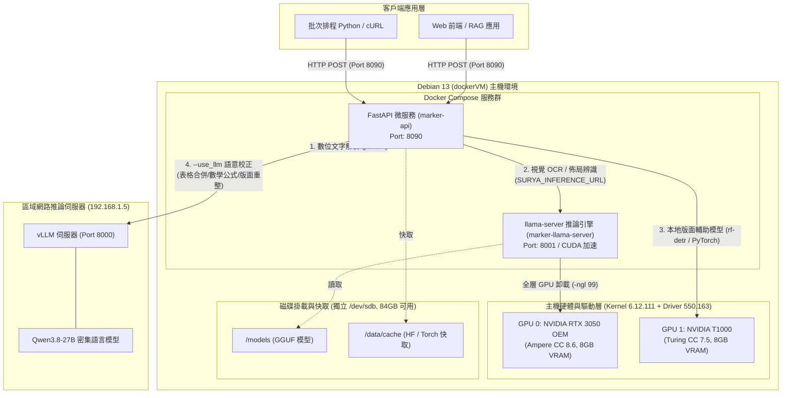
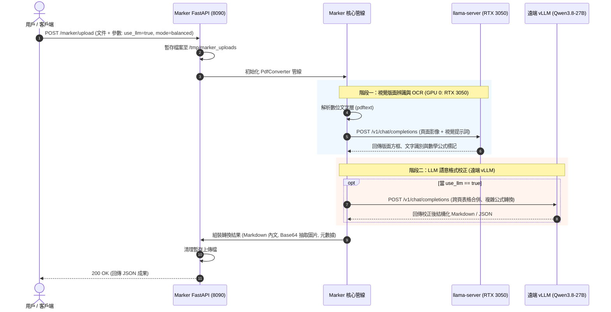
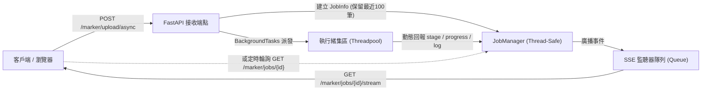
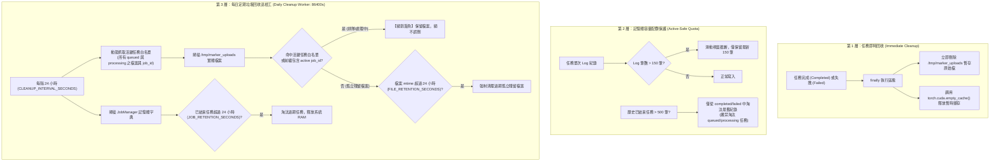
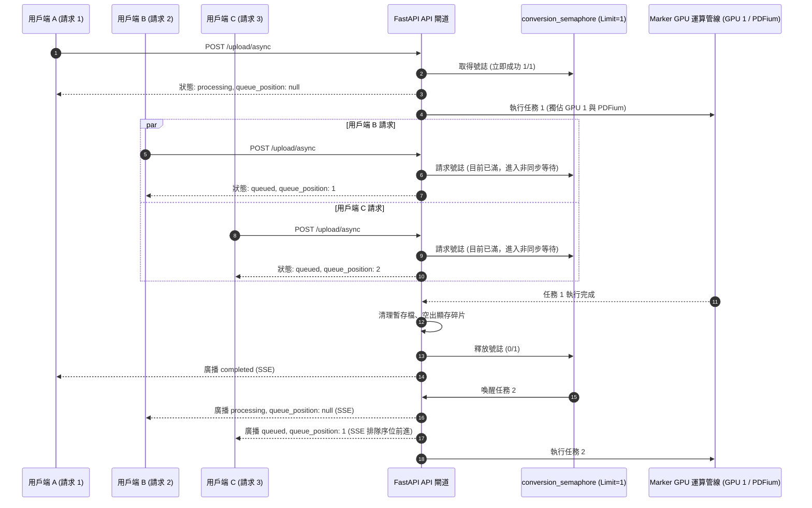

# Marker 文件轉換微服務 — 系統架構規劃說明書

本文件詳細闡述 **Marker Document Conversion Microservice** 在雙 GPU (NVIDIA RTX 3050 OEM + T1000) 環境下的完整技術架構、硬體拓撲、容器編排與資料流程設計。

---

## 一、 整體架構總覽 (Architecture Overview)

系統採用**微服務化 (Microservices) 與運算層級分離**之架構設計。前端提供標準 RESTful API，推論層分為**本機視覺感知 (Local VLM Perception)** 與**遠端語意校正 (Remote LLM Reasoning)** 雙軌運作。



---

## 二、 硬體與 GPU 運算拓撲設計

本虛擬機器配置有兩張不同架構世代的 NVIDIA GPU，各自具備 8GB 專屬視訊記憶體 (VRAM)：

| 屬性 | GPU 0 (主要視覺推論卡) | GPU 1 (輔助分析卡) |
| :--- | :--- | :--- |
| **晶片型號** | NVIDIA GeForce RTX 3050 OEM | NVIDIA T1000 8GB |
| **微架構代號** | GA106 (Ampere) | TU117GL (Turing) |
| **Compute Capability** | **8.6** (支援 BF16, FP16, INT8, INT4) | **7.5** (支援 FP16, INT8, INT4) |
| **視訊記憶體 (VRAM)** | 8,192 MB GDDR6 | 8,192 MB GDDR6 |
| **專屬任務分配** | **llama-server (Surya 2 GGUF VLM)**<br>專責全頁面 OCR、高解析度公式辨識 | **Marker 本地 PyTorch 輔助模型**<br>專責 `rf-detr` 版面偵測器、閱讀順序排序模型、OCR 錯誤過濾 |
| **顯存預估佔用** | 約 1.5 GB ~ 2.0 GB (保留 6GB+ 作為並行批次緩衝) | 約 1.0 GB ~ 1.5 GB |

> [!NOTE]
> **異質 GPU 架構決策**：
> 由於 Ampere (CC 8.6) 與 Turing (CC 7.5) 之指令集與運算單元特性不同，無法跨卡進行 Tensor Parallel (TP=2) 共同載入單一大型權重。本架構採**功能解耦 (Role-based Partitioning)**，充分發揮兩張顯卡的各自長處，避免跨卡匯流排同步之效能損耗。

---

## 三、 容器編排與服務組件

微服務由 `docker-compose.yml` 統籌管理兩個核心容器：

### 3.1 `marker-llama-server` 容器
* **映像檔**：`ghcr.io/ggml-org/llama.cpp:server-cuda`
* **功能**：以極致 C++ 效率提供 OpenAI 相容之 Vision-Language 推論端點。
* **模型**：載入 `datalab-to/surya-ocr-2-gguf` (`surya-2.gguf` 主模型 + `surya-2-mmproj.gguf` 多模態投影權重)。
* **加速參數**：
  * `-ngl 99`：全模型權重 100% 卸載至 RTX 3050 顯存中。
  * `--ctx-size 16384`：提供足夠的影像 Token 與文字 Context 空間。
  * `--parallel 8`：支援最高 8 路並行 OCR 辨識槽位。
* **監聽端口**：容器內部與內部網路 `8001`。

### 3.2 `marker-api` 容器
* **映像檔**：本機建置之 `Dockerfile`（基於 CUDA 12.4 Runtime 與 Python 3.11）。
* **功能**：
  * 提供對外 HTTP RESTful API（監聽於主機 Port `8090`）。
  * 整合 `marker-pdf[full]` 核心轉換管線，可自動處理 PDF、DOCX、PPTX、XLSX、EPUB 與一般影像。
  * 整合 `FastAPI`，支援 Swagger UI (`/docs`)、即時健康監控 (`/health`) 與檔案上傳處理。
  * 透過 `SURYA_INFERENCE_URL=http://llama-server:8001/v1` 將視覺請求交由 `marker-llama-server` 處理。
  * 當用戶傳入 `use_llm=true` 時，動態將跨頁表格、內嵌數學公式等語意增強任務路由至遠端 `http://192.168.1.5:8000/v1` 的 `Qwen3.8-27B` 進行處理。

---

## 四、 核心轉換時序圖 (Sequence Diagram)



---

## 五、 儲存架構與磁碟保護策略

由於虛擬機器根目錄 `/` 空間僅剩約 18GB，為避免模型快取與暫存檔導致系統磁區耗盡，本架構採取嚴謹的儲存隔離規劃：

1. **大容量專屬分區**：
   * 所有 Docker 資料、容器層、卷冊均位於 `/var/lib/docker`，此路徑掛載於實體磁碟 `/dev/sdb`（容量 94GB，可用高達 **84GB**）。
2. **目錄映射規劃**：
   * `./models`：掛載 Surya GGUF 模型權重檔（總計約 1.4GB）。
   * `./cache/huggingface`：HuggingFace 暫存快取目錄。
   * `./cache/torch`：PyTorch 輔助模型 (`rf-detr` 等) 下載目錄。
   * `./uploads`：上傳檔案臨時目錄（處理完畢後立即自動卸載與刪除）。

---

## 六、 即時進度追蹤與非同步架構 (Job & Progress Tracking Engine)

針對複雜長篇 PDF 或啟用大型語言模型 (LLM) 帶來的處理延遲，本系統在 `marker-api` 內構建了一套非同步任務管理與事件推播引擎：



1. **轉換器階層攔截 (`ProgressPdfConverter`)**：
   * 動態繼承 Marker 的 `PdfConverter` 類別，在 `build_document` 生命週期關鍵節點插入探針。
   * 精準捕獲：`uploaded (5%)` $\to$ `preparing (15%)` $\to$ `layout_ocr (25%)` $\to$ `structure (50%)` $\to$ `processors / llm_refinement (50%~90%)` $\to$ `rendering (92%)` $\to$ `done (100%)`。
2. **雙軌監聽機制 (SSE + Polling)**：
   * **SSE (`/marker/jobs/{id}/stream`)**：單一連線、低延遲推播，支援瀏覽器原生 `EventSource`，包含每 15 秒心跳保活。
   * **Polling (`/marker/jobs/{id}`)**：提供傳統無連線狀態的 RESTful 輪詢支援。
3. **即時日誌與例外捕獲**：
   * 每個任務均維護結構化時間戳日誌（`logs`）。
   * 任何在 OCR、PyTorch 或 LLM 階段產生的例外（如 PDF 損壞、格式不支援、模型超時），都會被全域例外處理器捕獲，將完整的錯誤訊息與 Python Traceback 寫入任務物件，並將狀態標記為 `failed`，避免客戶端永久掛起。

---

## 七、 資源回收與自動清理機制 (Resource Management & Garbage Collection)

為保障微服務在高負載、多請求環境下長期穩定運作，避免磁碟空間佔滿或 RAM/VRAM 顯存耗盡，同時確保在「大量排程任務同時湧入（數百個檔案排隊處理數小時以上）」情境下，**暫存檔案絕不遭到誤刪**，系統實施具備「動態白名單豁免機制」之三層式資源生命週期管理策略：



### 7.1 第一層：任務執行結束立即回收
* **暫存原始檔立即刪除**：無論同步或非同步轉換，文件寫入磁碟後均在 `try ... finally` 區塊中嚴格調用 `os.remove(upload_path)`，確保文件轉換結束（或遇錯中斷）時立刻銷毀實體檔案，磁碟不留滯任何正常任務的 PDF。
* **PyTorch 顯存即時釋放**：在任務完成時主動調用 `torch.cuda.empty_cache()`，將暫時分配的張量記憶體返還給作業系統與驅動，防止跨任務累積顯存碎片。

### 7.2 第二層：記憶體容量配額安全管制
* **任務日誌滑動視窗 (150 筆上限)**：每個任務維護的 `job.logs` 採用截斷式滑動視窗，上限為最新 150 條。即使極大文件包含數十個處理器，也不會因無窮日誌堆疊導致 FastAPI 行程記憶體膨脹。
* **歷史任務安全淘汰 (500 筆歷史配額)**：當歷史任務超出配額時，系統**僅針對已結束 (`completed` 或 `failed`) 的任務**進行淘汰，**永遠保留處於 `queued` (排隊中) 或 `processing` (執行中) 的活躍任務**。此舉防止在數百個檔案批次湧入時，排隊中任務被意外踢出記憶體造成客戶端查詢 404。

### 7.3 第三層：每日定期垃圾回收巡檢工 (`periodic_cleanup_worker`)
由 FastAPI `lifespan` 啟動的非同步背景協程，固定每隔 `CLEANUP_INTERVAL_SECONDS`（預設 **86400 秒 / 24 小時，一天一次**）全自動巡檢：
1. **動態活躍白名單保護 (Active Task Whitelist Protection)**：
   * 巡檢工掃描磁碟目錄時，即時調用 `job_manager.get_active_file_identifiers()`。
   * **完整路徑與檔名比對**：所有當前狀態為 `queued` 或 `processing` 之任務關聯檔案，直接列入豁免清單。
   * **Job ID 前綴比對**：凡檔名前綴開頭為任何活躍中的 `job_id`（如 `job_20261001_...`），一律強制豁免。
   * **效力保證**：即使排隊佇列累積數百份檔案、排隊耗時長達 10~20 個小時，**只要任務仍在隊列中等待，其暫存檔案就絕不會被誤刪**。
2. **孤立殘留檔案清理 (TTL: 86400 秒 / 24 小時)**：
   * 只有**完全不屬於任何排隊或執行中任務**的非活躍檔案（如客戶端上傳中途斷網導致的未完成傳輸檔、或伺服器非正常重啟遺留的前次垃圾），且最後修改時間超過 24 小時者，才判定為孤立殘留垃圾予以安全刪除。
3. **已結束任務記憶體淘汰 (TTL: 86400 秒 / 24 小時)**：
   * 已完成或失敗超過 24 小時的任務元數據自動從記憶體中抹除。
4. **顯存碎片深層整理**：巡檢週期觸發 `torch.cuda.empty_cache()`。

---

## 八、 並行排程與併發流量保護機制 (Concurrency Control & FIFO Queue)

在文件轉換場景中，PDF 解析與 OCR 涉及深層 C++ 函式庫與 GPU 矩陣加速，若無併發流量管制，多請求同時湧入將導致系統致命性崩潰。

### 8.1 關鍵技術內幕：為什麼不能盲目多執行緒並行？
在架構設計初期驗證過程中，我們發現了兩項底層硬體與函式庫的嚴格限制：
1. **`libpdfium.so` 底層 C++ 執行緒不安全 (Critical Race Condition)**：
   Marker 底層的 `pypdfium2`（基於 Google Chrome PDFium 引擎）在多執行緒環境中**非執行緒安全 (Not Thread-Safe)**。當同一行程內有多個執行緒同時呼叫 PDFium 解析或渲染頁面時，會發生記憶體衝突，直接引發作業系統核心陷阱：
   `traps: uvicorn[...] general protection fault in libpdfium.so`
   這會導致整個 Python 行程瞬間 Segfault 終止、Docker 容器無預警重啟，所有進行中的任務全數中斷。
2. **GPU 顯存 (VRAM) 安全上限**：
   本機輔助卡 NVIDIA T1000 僅具備 8GB 顯存。Marker 的 `rf-detr`、閱讀順序排序模型與版面分析在處理高解析度、多頁面時會佔用 1.5GB ~ 2.5GB 顯存。若允許多個大文件並行推論，極易突破 8GB 觸發 `CUDA Out Of Memory (OOM)`。

### 8.2 FIFO 佇列排程器設計
為徹底根絕上述問題，系統採用 **非同步號誌佇列 (Asyncio Semaphore Queue)**：



1. **核心序列化保護 (`MAX_CONCURRENT_CONVERSIONS=1`)**：
   * 系統透過 `asyncio.Semaphore(1)` 確保任何時刻**只有一個轉換任務**存取 `pypdfium2` 與本地 GPU 1。
   * 此舉保證了 `libpdfium.so` 運算絕對安全、0% Segfault 崩潰風險、0% CUDA OOM 風險。
2. **零阻斷排隊機制 (Non-blocking Queued State)**：
   * 當系統正忙碌時，新進的非同步請求**不會被拒絕 (不會 429 或 503)**，而是立即建立任務，賦予 `status="queued"` 與 `queue_position`（第 1 位、第 2 位...）。
   * 外部客戶端可立即取得 `job_id`，並透過 SSE 串流連線接收即時序位通知。
3. **動態序位推播 (Dynamic Queue Notification)**：
   * 每當前一個任務完成並釋放號誌時，`JobManager.notify_queue_update()` 會主動重新計算後續所有排隊中任務的序位，並透過 SSE 自動推播「排隊序位前進」給所有等待中的用戶端。
4. **即時健康監控指標**：
   * `GET /health` 端點即時揭露 `queue_status`：
     ```json
     "queue_status": {
         "max_concurrent_limit": 1,
         "active_processing_jobs": 0,
         "queued_waiting_jobs": 0,
         "total_jobs_in_memory": 3
     }
     ```
   維運人員或外部負載平衡器可輕易掌握當前系統忙碌狀態與隊列深度。


