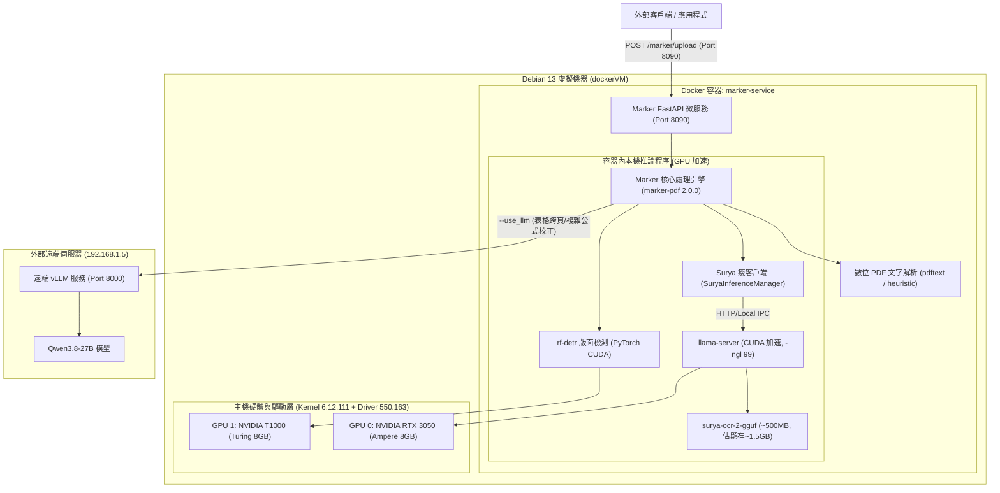

# Marker PDF 轉換微服務與雙 GPU (RTX 3050 + T1000) 部署實作計劃書

本計劃書針對在 Debian 13 虛擬機器上建置高效能 **Marker** 文件轉換微服務進行完整架構設計與實作規劃。

---

## 一、 目標與現況分析 (Goal Description & Context)

### 1.1 核心目標
1. **啟用 VM 兩張 GPU**：包含 NVIDIA GeForce RTX 3050 OEM (8GB, Ampere CC 8.6) 與 NVIDIA T1000 (8GB, Turing CC 7.5)，解決目前驅動未能載入之問題並確保 `nvidia-smi` 運作正常。
2. **Docker 化與平滑更新**：在專案根目錄建立 `docker-compose.yml` 與 `Dockerfile`，支援以環境變數更新至最新 Marker 版本。
3. **GPU 視覺辨識與推論加速**：Marker 容器啟用本機 GPU 加速（整合 CUDA 版 llama-server 載入 Surya GGUF 模型，顯存僅需 ~1.5GB，無須 Docker-in-Docker）。
4. **串接遠端 Qwen3.8-27B vLLM 進行 `--use_llm`**：將 Marker 後處理校正層對接現有區域網路 vLLM 伺服器（`http://192.168.1.5:8000/v1`，模型 `Qwen3.8-27B`）。
5. **包裝為標準微服務**：提供對外 HTTP REST API（監聽於 Port `8090`，避免與既有 RAGFlow 衝突），支援檔案上傳轉換、參數切換、健康檢查 (`/health`) 與 Swagger UI (`/docs`)。
6. **專案文件化**：將最終規劃架構、使用說明、技術維護文件與實作計劃書完整收錄於專案 `doc/` 目錄中。

### 1.2 系統與硬體現況調查結果
* **作業系統**：Debian GNU/Linux 13 (trixie), 核心目前啟動為 `6.12.74+deb13+1-amd64`。
* **GPU 實體**：
  * `01:00.0`：NVIDIA Corporation GA106 [GeForce RTX 3050 OEM] (8GB VRAM)
  * `02:00.0`：NVIDIA Corporation TU117GL [T1000 8GB] (8GB VRAM)
* **驅動現狀診斷**：
  * 系統已安裝 `nvidia-driver 550.163.01-2` 與 `nvidia-kernel-dkms`。
  * DKMS 模組已於日前編譯安裝於 `6.12.111+deb13-amd64` 核心目錄下。
  * 但目前主機運行的核心為舊版 `6.12.74`，導致開機時載入了開源 `nouveau` 驅動，`nvidia-smi` 因而報錯。GRUB 預設選單已將 `6.12.111` 設為第一優先開機項，**只需重開機即可自動載入 NVIDIA 官方專有驅動**。
* **磁碟空間分佈**：
  * 根目錄 `/` 剩餘 18 GB。
  * `/var/lib/docker` 掛載於獨立 94GB 磁碟（`/dev/sdb`），剩餘可用空間高達 **84 GB**，空間非常充裕。
* **網路連線驗證**：
  * 已成功連通區域網路 `http://192.168.1.5:8000/v1/models`，遠端 vLLM 提供 `Qwen3.8-27B` 服務正常。

---

## 二、 系統架構設計 (System Architecture)



### 2.1 GPU 職責分工策略
* **GPU 0 (RTX 3050, Ampere CC 8.6, 8GB VRAM)**：
  * 指派給 Surya OCR / 版面辨識的推論引擎（CUDA 版 llama-server）。
  * 支援 FP16 與 BF16，提供最快的美型與文字定位速度。顯存佔用僅約 1.5GB，其餘 6.5GB 作為影像批次快取。
* **GPU 1 (T1000, Turing CC 7.5, 8GB VRAM)**：
  * 指派給 Marker 的本地輔助深度學習模型（`rf-detr` 版面偵測器、閱讀順序排序模型、OCR 錯誤校正 DistilBERT）。
  * 亦可保留為備用推論卡或給主機其他服務使用。

### 2.2 遠端 `--use_llm` 整合機制
* Marker 內建支援 OpenAI-compatible 協定之 LLM 服務 (`marker.services.openai.OpenAIService`)。
* 透過微服務設定將 Base URL 導向 `http://192.168.1.5:8000/v1`，模型指定為 `Qwen3.8-27B`，無需金鑰 (`api_key="none"`)。
* 呼叫端可於 API 請求中自由設定 `use_llm=true` 或 `false`。

---

## 三、 需要使用者審查的項目 (User Review Required)

> [!IMPORTANT]
> **主機重開機確認 (Phase 1 執行前)**：
> 由於核心版本已更新至 `6.12.111` 且 NVIDIA 驅動 DKMS 模組編譯完成，必須執行一次系統重開機（`systemctl reboot`）以載入新核心與 NVIDIA 模組。在您批准本計劃書後，我們將在執行階段的第一步引導或執行此步驟，重開機後 SSH 連線恢復即可接續驗證。

> [!NOTE]
> **儲存路徑設計**：
> HuggingFace 與 GGUF 模型快取預設將映射至主機專案目錄或 Docker Volume（位於 `/dev/sdb`，有 84GB 充裕空間），絕不佔用剩餘僅 18GB 的根目錄磁區。

---

## 四、 實作工作分解與變更明細 (Proposed Changes)

### 階段一：專案目錄與設定檔建置
將於 `/home/gaven/marker-service/` 建立標準微服務結構：

```
marker-service/
├── Dockerfile                  # 基於 CUDA 12.4 + Python 3.11 的微服務鏡像
├── docker-compose.yml          # Docker Compose 服務編排設定
├── .env.example                # 環境變數範本檔
├── .env                        # 運行環境變數 (含 GPU 設定、遠端 vLLM URL、Port 8090)
├── requirements.txt            # 專案相依套件清單 (marker-pdf[full], fastapi, uvicorn, etc.)
├── server/
│   ├── __init__.py
│   ├── app.py                  # 擴充版 FastAPI 微服務 (支援檔案上傳、健康檢查、參數切換)
│   └── config.py               # 服務參數配置模組
├── scripts/
│   ├── entrypoint.sh           # 容器啟動腳本 (檢查 llama-server 與初始化模型)
│   └── update.sh               # 一鍵升級 Marker 版本腳本
└── doc/
    ├── implementation_plan.md  # 實作計劃書 (本文件)
    ├── architecture.md         # 系統規劃與架構說明文件
    ├── user_guide.md           # API 使用指南與呼叫範例 (curl, python, postman)
    └── maintenance.md          # 系統維護、顯卡監控與疑難排解手冊
```

#### [NEW] `docker-compose.yml`
* 包含 `marker-service` 服務。
* 設定 `deploy.resources.reservations.devices` 掛載 GPU（支援指定 device 0,1 或全部）。
* 映射端口 `8090:8090`。
* 掛載模型快取目錄至本機目錄，確保重啟不需重複下載模型。

#### [NEW] `Dockerfile`
* 基底映像檔：`nvidia/cuda:12.4.1-runtime-ubuntu22.04` (或 Debian trixie runtime)。
* 安裝系統依賴：Python 3.11、Poppler-utils、Ghostscript、Tesseract、libgl1 等文件轉檔必要函式庫。
* 下載預編譯 CUDA 版 `llama-server` (支援 `-ngl 99` 全 GPU 卸載)。
* 安裝 PyTorch (CUDA 12.4) 與 `marker-pdf[full]` 最新版。
* 複製微服務程式碼並設定非 root 使用者執行。

#### [NEW] `server/app.py`
* 擴充原有 `marker.scripts.server` 功能：
  * `GET /health`：回傳服務健康狀態、GPU 偵測資訊、CUDA 可用性與遠端 vLLM 連線狀態。
  * `POST /marker/upload`：接收 PDF/圖片/DOCX/PPTX 等多種格式檔案，支援動態設定：
    * `use_llm` (bool, 預設 false，可切換為 true 啟用遠端 Qwen3.8-27B)
    * `mode` (balanced / fast)
    * `output_format` (markdown / json / html / chunks)
    * `page_range` (分頁範圍指定)
    * `force_ocr` (強制全文 OCR)
    * `paginate_output` (分頁標記)
  * `POST /marker`：伺服器本地路徑轉換。
  * CORS 跨來源資源共享中介軟體（允許前端網頁直連呼叫）。

#### [NEW] `scripts/update.sh`
* 透過 `docker compose build --no-cache` 或更新 requirements.txt，重啟容器即自動取得最新版本 Marker。

---

### 階段二：VM 重啟與 NVIDIA 驅動驗證
1. 執行 `systemctl reboot` 重新開機。
2. 重開機後執行 `uname -r` 確認切換至 `6.12.111+deb13-amd64`。
3. 執行 `nvidia-smi` 驗證：
   * GPU 0: RTX 3050 OEM (驅動 550.163.01) 正確識別。
   * GPU 1: T1000 (驅動 550.163.01) 正確識別。
4. 驗證 Docker NVIDIA Container Runtime：
   * 執行 `docker run --rm --gpus all nvidia/cuda:12.4.1-base-ubuntu22.04 nvidia-smi` 確認容器可穿透存取雙顯卡。

---

### 階段三：建置與啟動 Marker 微服務
1. 建立 `.env` 設定檔並填入：
   * `PORT=8090`
   * `SURYA_INFERENCE_BACKEND=llamacpp`
   * `LLAMA_CPP_NGL=99`
   * `OPENAI_BASE_URL=http://192.168.1.5:8000/v1`
   * `OPENAI_MODEL=Qwen3.8-27B`
   * `OPENAI_API_KEY=none`
2. 執行 `docker compose build` 建置容器映像檔。
3. 執行 `docker compose up -d` 啟動服務。

---

### 階段四：撰寫專案完整技術文件 (doc/)
於 `/home/gaven/marker-service/doc/` 目錄寫入：
1. `doc/implementation_plan.md`：本實作計劃書之存檔。
2. `doc/architecture.md`：系統整體架構、網路拓撲、GPU 運算分配、軟體組件圖。
3. `doc/user_guide.md`：完整的 API 規範、Swagger 文件說明、使用 `curl` 與 Python 客戶端發送請求之範例、參數詳解。
4. `doc/maintenance.md`：系統管理、NVIDIA 驅動故障排除、容器生命週期、Marker 版本一鍵更新流程、GPU 資源監控指令指南。

---

## 五、 驗證與測試計劃 (Verification Plan)

### 5.1 自動化驗證 (Automated Verification)
1. **GPU 驅動驗證**：
   ```bash
   nvidia-smi
   docker run --rm --gpus all nvidia/cuda:12.4.1-base-ubuntu22.04 nvidia-smi
   ```
2. **服務健康狀態檢測**：
   ```bash
   curl -s http://127.0.0.1:8090/health | jq .
   ```
   * 預期結果：`status: "healthy"`, `cuda_available: true`, `gpus: ["RTX 3050", "T1000"]`, `remote_llm_connected: true`。
3. **基礎 PDF 轉換驗證 (Fast / Balanced 模式)**：
   * 下載或產生測試 PDF，調用 `/marker/upload`。
   * 驗證回傳 JSON 包含 `success: true` 與提取之 Markdown 內容。
4. **遠端 `--use_llm` 整合驗證**：
   * 調用 `/marker/upload` 並帶入 `use_llm=true`。
   * 驗證轉換過程成功調用遠端 Qwen3.8-27B 模型，且 Markdown 表格或結構格式化精確無誤。
5. **GPU 顯存佔用監控**：
   * 轉換過程中執行 `nvidia-smi` 觀察 GPU 0 與 GPU 1 顯存增長與計算佔用，確認推論完全於 GPU 上運行。

### 5.2 人工手動驗證 (Manual Verification)
1. 於瀏覽器開啟 `http://<VM_IP>:8090/docs`，透過 Swagger UI 互動介面直接上傳自訂 PDF 檔案並測試轉換效果。
2. 檢閱 `doc/` 目錄下之所有技術文檔，確認排版、說明與操作流程完備。
